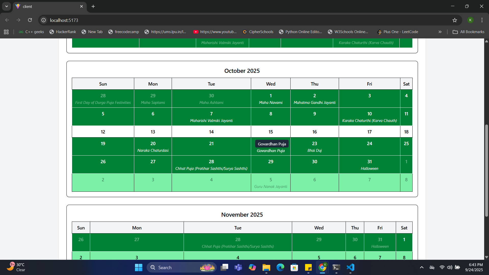

Vacation Calendar Project

A responsive and interactive Vacation Calendar application that allows users to view holidays and vacations in monthly or quarterly views. The calendar highlights weeks based on the number of holidays:

1 holiday in a week → Light green row

More than 1 holiday in a week → Dark green row with white text

This project helps organizations and individuals efficiently track holidays and vacations.

📁 Folder Structure
project-root/
├─ client/          # React frontend application
├─ server/          # Backend server (APIs, data handling)
├─ images/          # Output images/screenshots of the calendar (images1.png to images7.png)

✨ Features

Responsive Design: Works seamlessly on desktop and mobile devices.

Monthly & Quarterly Views: Toggle between monthly and 3-month views.

Holiday Highlighting: Weeks are highlighted visually based on holidays.

Clean and Simple UI: Organized layout with proper alignment and hover effects.

Country Selection: Choose from different countries to view holidays.

Hover Tooltips: Display holiday names when hovering over a date.

🛠 Technologies Used

Frontend: React, Tailwind CSS

Backend: Node.js, Express

HTTP Requests: Axios

Date Handling: dayjs

Environment Management: dotenv

Version Control: Git & GitHub

🚀 Setup Instructions
1. Clone the repository
git clone <your-repo-link>
cd project-root

2. Setup and run the client
cd client
npm install
npm run dev

3. Setup and run the server
cd ../server
npm install
node server.js

4. Open the application

Visit http://localhost:5173
 (or the port your frontend is running on).

🖼 Screenshots

Monthly View

Quarterly View

Holiday Highlighting

Country Selection

Tooltip on Hover

Mobile View

Full Calendar View

⚙ How It Works

Country Selection: Users select a country from the dropdown; the frontend fetches available countries via the /api/countries endpoint.

Date Selection: Users select the month/year to view; the frontend calculates the start and end dates.

Fetch Holidays: The frontend calls /api/holidays with the selected country and date range.

Render Calendar:

1 holiday → light green row

More than 1 holiday → dark green row with white text

Hover Tooltips: Hovering over a holiday displays its name.

Responsive Layout: The calendar adjusts automatically between mobile, tablet, and desktop screens.

👤 Author

Your Name – V Kushwanth Kumar
Email: vkushwanth2004@gmail.com
